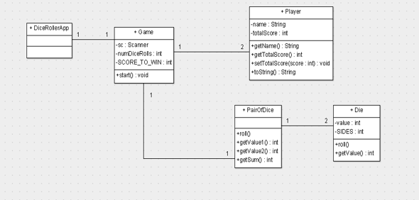
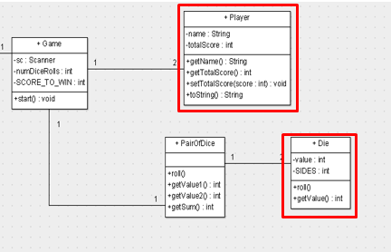
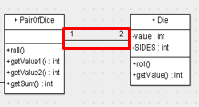
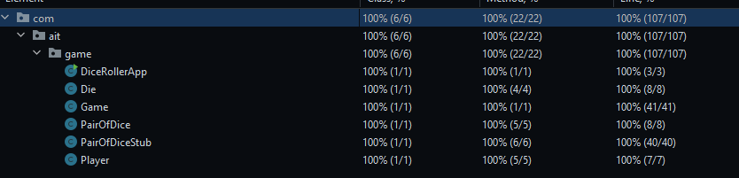

████████╗███████╗░██████╗████████╗██╗███╗░░██╗░██████╗░
╚══██╔══╝██╔════╝██╔════╝╚══██╔══╝██║████╗░██║██╔════╝░
░░░██║░░░█████╗░░╚█████╗░░░░██║░░░██║██╔██╗██║██║░░██╗░
░░░██║░░░██╔══╝░░░╚═══██╗░░░██║░░░██║██║╚████║██║░░╚██╗
░░░██║░░░███████╗██████╔╝░░░██║░░░██║██║░╚███║╚██████╔╝
░░░╚═╝░░░╚══════╝╚═════╝░░░░╚═╝░░░╚═╝╚═╝░░╚══╝░╚═════╝░

Bugs found so far:

Double print goodbye if player one wins.\
Does not check player one hitting an exact 20 for draw, counts it as a draw if over 20.\
Does not roll dice for player two, reuses values from roll one.\
Rounds start at two.\
Die rolls can hit a 0; should be 1-6.\
Repeats Dice 1 twice for player one.

<h3>Unit Tests:</h3>

Using the bottom up implementation testing method, \
the unit tests for classes deemed outside by the UML were written first\
classes that did not communicate with other classes were tested to ensure\
that the class was working as intended.

Once the smallest "units of software" were tested, then came\
the integration tests.

<h3>Integration tests:</h3>

Integration tests are implemented to classes that use other classes\
to ensure that the classes are working together as intended.\
This was done using the UML Diagram to determine which classes\
communicated with each other.

For example, unit tests were written for the Die class\
and integration tests were written for PairOfDice class\
since the PairOfDice class uses the Die class.

Since everything combined inside the Game class, the Game class\
was tested last with a stub to manipulate the values inside it for all\
three possible outcomes of the application.

The coverage report shows that all classes are tested\
and all methods are tested.

<h3>Manual Tests:</h3>

Once unit tests and integration tests were written, the manual tests\
were used, created from real world scenarios (user stories), to ensure that the\
program was working as intended.

